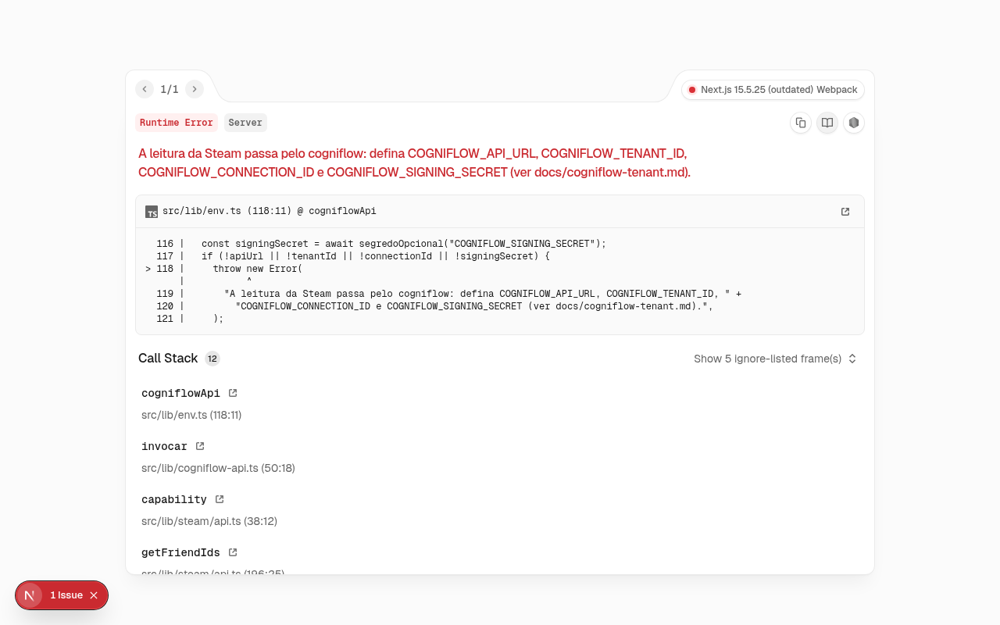
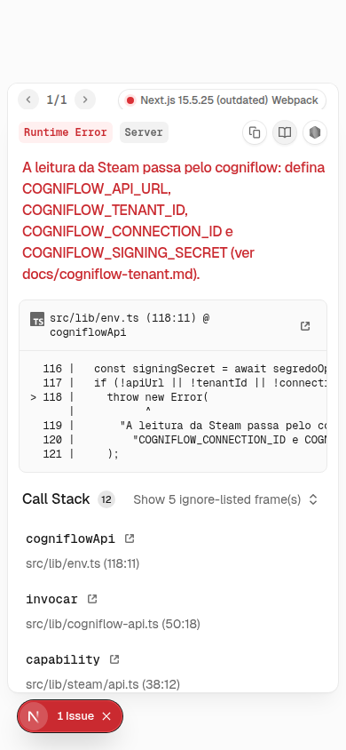
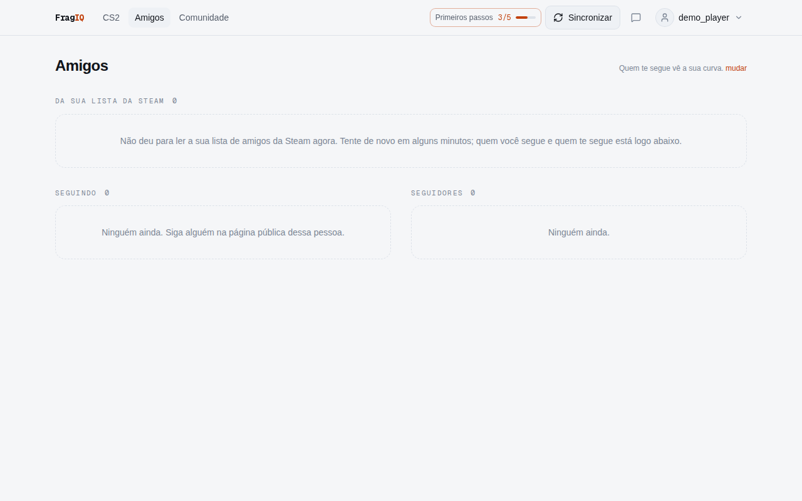
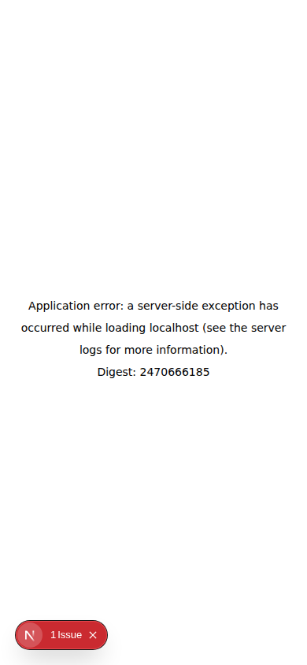
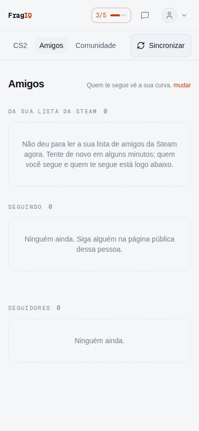
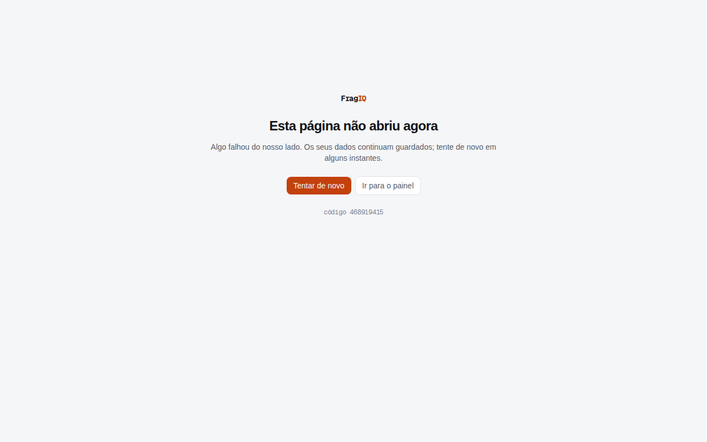

## Problema
A página de amigos chama `steam.friends.read` no cogniflow durante o render e
não trata a falha. Qualquer erro dessa chamada (cogniflow fora, timeout de
`AbortSignal.timeout`, recusa da Steam, variável faltando) derruba a página
inteira com 500, e o app não tem nenhum `error.tsx`, então a pessoa vê a tela
de erro padrão em vez de "Seguindo" e "Seguidores", que vêm só do nosso banco.
A mesma falha em `/games/730/inventario` já é tratada e a página abre.

Também quebra a promessa do README de avaliar a interface sem Steam
(`npm run seed` + `/api/auth/dev-login`): `/amigos` é a única rota logada que
não abre nesse modo.

## Evidências

- Pilha e comparação com as outras rotas: `../evidencias/FQ-0001/console.txt`
- Código: `src/app/amigos/page.tsx:33` → `src/lib/social.ts:32` →
  `src/lib/steam/api.ts:196` (sem try/catch no caminho).

## Critérios de aceite
- [x] Dado que a capability `steam.friends.read` falha (lança erro ou dá
      timeout), quando a pessoa abre `/amigos`, então a página responde 200,
      mostra "Seguindo" e "Seguidores" e, no lugar da seção "Da sua lista da
      Steam", um aviso curto de que a lista não pôde ser lida agora.
- [x] A falha fica no log do servidor com contexto (sem steamId completo nem
      segredo).
- [x] Existe um `src/app/error.tsx` (ou por segmento) com a identidade do site
      para qualquer outro erro inesperado.
- [x] Teste (vitest de `amigosNoFragiq` com a capability falhando) e e2e local
      (seed + dev-login sem `COGNIFLOW_*`) cobrem o cenário.

## Notas técnicas
Seguir o padrão de `inventario` (`[inventario.leitura]`). Diferenciar "lista
privada" (ids vazios) de "falhou a leitura": hoje só o primeiro tem texto.

## Conversa
### 2026-09-29 · PO
Aberto na varredura diária. P1: não vi o erro em produção nas últimas 24 h
(`get_runtime_errors` vazio), mas é a única rota logada que cai inteira quando
o cogniflow oscila.

### 2026-09-29 · Dev
Reproduzido no app local (seed + dev-login, sem `COGNIFLOW_*`): `/amigos` 500
no desktop e no celular. Corrigi em `amigosNoFragiq`: a leitura que falha vira
`leituraFalhou` (distinto de lista privada), vai para o diário como
`amigos.leitura` (mesmo padrão de `inventario.leitura`, com o id interno da
conta, sem steamId nem segredo) e não entra no cache de 10 min, então a
próxima visita tenta de novo. A página mostra o aviso no lugar da seção da
Steam e mantém Seguindo e Seguidores.
Decisões minhas: (1) `src/app/error.tsx` único, na raiz, com o logotipo do
cabeçalho e o `digest` do erro (sem a mensagem); (2) o projeto não tinha E2E:
entrou `@playwright/test` 1.56.0 (a versão do Chromium já instalado nas
rotinas) como devDependency, `playwright.config.ts` (desktop 1280x800 e
celular 390x844, sobe o `next dev` sozinho) e o script `test:e2e`. O E2E não
roda no CI nem no build da Vercel; roda local com o banco do seed.

### 2026-10-03 · Dev
Rebase na `main` (site na AWS e PR #7 já dentro). Conflito em
`src/app/error.tsx`: ficou o do #7 (`components/falha.tsx`), que tem o mesmo
papel; o desta branch saiu. `.gitignore` somou as linhas do Playwright às do
pacote da Lambda. Na `main` o FQ-0002 e o FQ-0003 já estavam `feito`, então o
INDEX ficou com o status de lá. Status continua `feito`; falta a PO validar em
produção.

## Entrega
- **Resumo:** `/amigos` abre mesmo quando o cogniflow ou a Steam falham: a
  pessoa vê quem segue e quem a segue, e um aviso de que a lista da Steam não
  pôde ser lida agora. Qualquer outro erro inesperado mostra uma tela do FragIQ
  com "Tentar de novo", em vez da tela padrão do Next.
- **Commits:** `ac6a792` na branch `rotina/dev-2026-09-29`, rebaseada na
  `main` em 03/10 e entregue pelo PR #21.
- **Arquivos:** `src/lib/social.ts`, `src/app/amigos/page.tsx`,
  `playwright.config.ts`, `package.json`. O `src/app/error.tsx` desta entrega
  deu lugar ao do PR #7 (`components/falha.tsx`), que chegou antes à `main` e
  cumpre o mesmo critério.
- **Testes:** `tests/lib/amigos-leitura.test.ts` (falha vira `leituraFalhou` e
  vai ao diário; falha não fica em cache) e `e2e/amigos.spec.ts` (200, Seguindo,
  Seguidores e o aviso, desktop e celular). Resultado em
  `../evidencias/FQ-0001/dev-testes.txt`: 170 unitários e 2 E2E verdes.
- **Antes / depois:**

  | Antes | Depois |
  |---|---|
  |  |  |
  |  |  |

  Tela de erro desta entrega (rota de teste temporária, não commitada; na
  `main` vale a do PR #7, com o mesmo "Tentar de novo" e o `digest`):
  
- **Como validar:** local: `docker compose up -d && npm run db:migrate && npm
  run seed`, `.env` sem `COGNIFLOW_*`, `npm run test:e2e`. Em produção (depois
  do push): `/amigos` logado abre 200; `get_runtime_errors` sem erro novo de
  `/amigos`.
