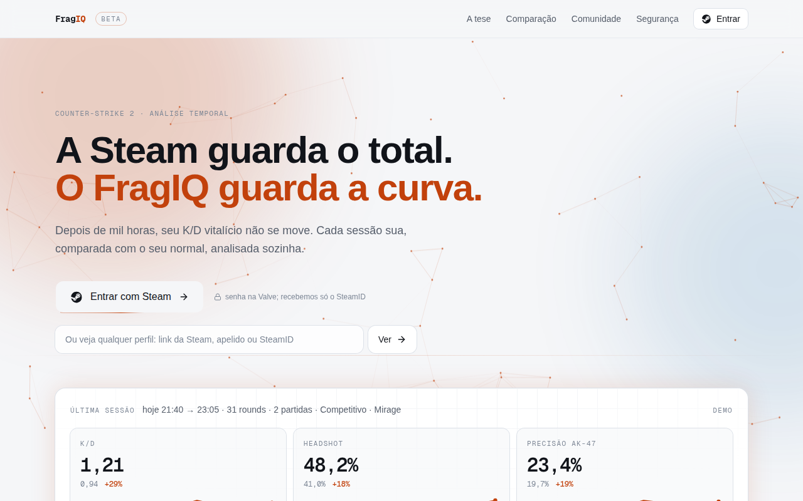

## Problema
O axe (WCAG 2 AA) acusa 21 elementos com contraste insuficiente na home de
produção. Quase todos são o cinza `#7c8695` (`text-ink-faint`) em 11–12 px sobre
branco ou `#f5f6f8`, com razão 3,1–3,7 (mínimo 4,5). É justamente o texto que
explica cada estatística ("178 contadores do CS2…", "10 s", rótulos "A tese").
Quem ganha: quem lê no celular sob luz forte e quem tem baixa visão; a home é a
porta de entrada do beta aberto.

## Evidências

- Resultado do axe agrupado por cor: `../evidencias/FQ-0002/axe-color-contrast.txt`
  (inclui "IQ" do logo em `#c2410c` sobre `#f2eae8`, razão 4,36).

## Critérios de aceite
- [ ] Dado a home em produção, quando o axe roda com `wcag2aa`, então não há
      violação `color-contrast`.
- [ ] A troca é feita no token (uma cor para `ink-faint` com razão ≥ 4,5 sobre
      `#ffffff` e `#f5f6f8`), não página a página.
- [ ] Um teste com `@axe-core/playwright` (ou vitest calculando a razão dos
      tokens) impede a regressão.

## Notas técnicas
Cálculo de referência: `#6b7280` dá 4,83 sobre branco mas 4,47 sobre
`#f5f6f8` (não basta); `#5f6875` dá 5,64 / 5,22 / 4,76 sobre branco, `#f5f6f8`
e `#f2eae8`. Conferir com `docs/design.md` antes de escolher.

## Conversa
### 2026-09-29 · PO
Aberto na varredura diária.

## Entrega
(preenchido pelos devs)
